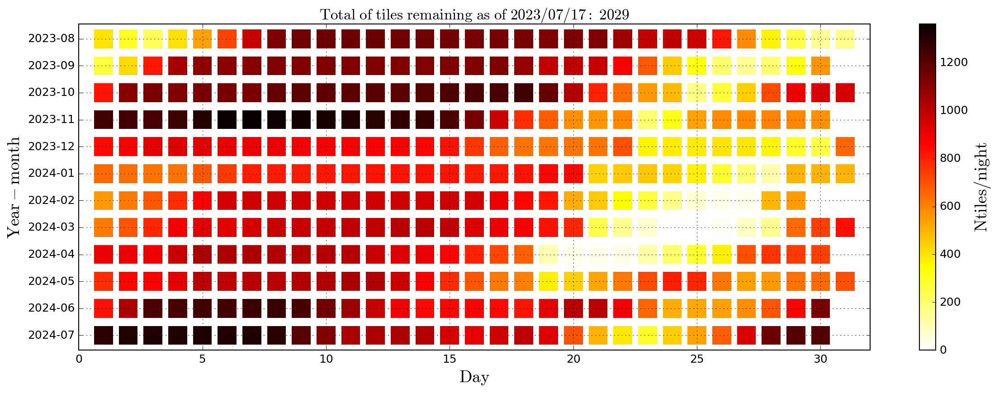

# calc_fields_density

## Overview

The `calc_fields_density.py` script calculates the observability of a set of fields over a range of dates provided by the user and generates a table containing the results of the simulation. The script also offers the option to plot the density of observable fields over the specified date range, which can be visualized or saved as a PNG file.

## Requirements

- Python 3.x
- Required Python packages: numpy, astropy, matplotlib, datetime, argparse, logging, colorlog, multiprocessing

## Usage

1. Clone the repository:

   ```bash
   git clone https://github.com/splus-collab/splus-daily-field-density.git
   ```

2. Navigate to the repository directory:

   ```bash
   cd splus-daily-field-density
   ```

3. Install the required packages:

   ```bash
   pip install -r requirements.txt
   ```

4. Run the script with the desired arguments:

   ```bash
   python calc_fields_density.py -ns <start_date> -ne <end_date> -f <fields_file> [-o <output_file>] [-w <workdir>] [-n <ncores>] [-op <output_plot>] [-v] [-sp] [-t <oper_type>] [-s <sym_file>] [-u <update_date>]
   ```

   - Required arguments:
     - `-ns, --start_date`: Date to start the simulation and/or plot (format: YYYY-MM-DD)
     - `-ne, --end_date`: End date of the simulation and/or plot (format: YYYY-MM-DD)
     - `-f, --fields`: S-PLUS fields file

   - Optional arguments:
     - `-o, --output_file`: Output file (default: 'tiles_nc_density_<start_date>_<end_date>.csv')
     - `-w, --workdir`: Working directory (default: current directory)
     - `-n, --ncores`: Number of cores (default: 1)
     - `-op, --output_plot`: Name of the output plot
     - `-v, --verbose`: Verbose mode
     - `-sp, --save_plot`: Save the figure as a PNG file
     - `-t, --oper_type`: Type of operation. Valid options are: calc, plot, or both (default: both)
     - `-s, --sym_file`: Output file from the simulation (required if --oper_type=plot)
     - `-u, --update_date`: Date of S-PLUS observations last update. Format: YYYY-MM-DD (default: current date)

5. Example usage to calculate the field density and plot the results:

   ```bash
   python calc_fields_density.py -ns 2023-08-01 -ne 2024-07-31 -f tiles_nc.csv -n 4 -sp -w ./data
   ```

   This command calculates the field density from August 1, 2023, to July 31, 2024, using the 'tiles_nc.csv' file and saves the plot as a PNG file to the workdir.
   All files needed to run the previous line are included. To avoid calculating the full symulation, the plot cal be
   done providing the sym_file with ```bash --sym_file name_of_sym_file.csv```. The file must be in the workdir.

### NOTE: The repository contains a CSV file with the simulation for 2 years, hence not requiring the user to spend time doing it to obtain the plot.

## Example Output

This is an example output plot generated by the `calc_fields_density.py` script.



## License

This project is licensed under the [GNU General Public License v3.0](LICENSE) - see the LICENSE file for details.
```

In this example, the README.md file provides an overview of the script, lists the prerequisites, explains the usage with required and optional arguments, includes an example command, displays a placeholder for the example output plot, and mentions the license information.

Remember to replace `<start_date>`, `<end_date>`, and other placeholders in the command and example output with actual values relevant to your script and data. Additionally, include the actual example output plot by replacing the `` placeholder with the appropriate Markdown syntax for displaying images (e.g., ``).
